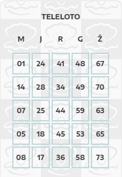

# Teleloto

## Rules of the game *:

* Players get ticket with generated numbers. Table has 5 columns with diffrent set of possible numbers: 

M⊂[1,15]; J⊂[16,30]; R⊂[31,45]; G⊂[46,60]; Ž⊂[61,75] 

* Game has diffrent stages:
    * First stage : 38 balls rolled. 
    * Second stage: additional 10 balls rolled. 
    * Third stage: balls are rolled until one ticket will be filled fully.

* Game has diffrent prize tiers and patterns:
    * Corners - during first stage.
    * Line - during first stage.
    * Cross - during first stage.
    * Full table - during first and second stage. "Grand" prize.
    * Full table - during third stage. "Big" prize

* Players must purchase their tickets before the draw takes place.

* Ticket price 1€

## Simulation results + expected average wins:

| Prize tier | Simulation probability** | Stated probability ***| Average prize amount ****|
| ----------- | ------:| ------: | -----------:   |
| Corners | 5.44E-02 | 6.06E-02 | 1,00 € |
| Line    | 2.53E-02 | 2.91E-02 | 2,50 €    |
| Cross   | 9.86E-04 | 2.90E-03 | 20,00 €    |
| Table   | 2.48E-07 | 3.57E-07 | 4.000,00-300.000,00 €      |

\* information taken from : https://lpt.lrv.lt/uploads/lpt/documents/files/%2C%2CTeleloto''(1).pdf (sorry all document in Lithuanian language)

\** 100 mln. tickets simulated 

\*** winnig probability stated in https://lpt.lrv.lt/uploads/lpt/documents/files/%2C%2CTeleloto''(1).pdf by game host.

\**** amount depends on amount of tickets sold.

